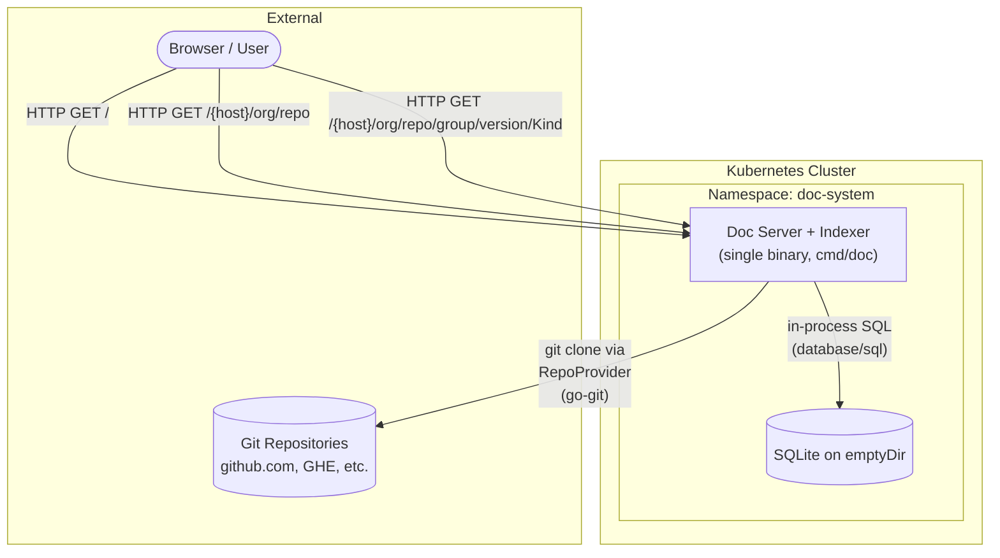
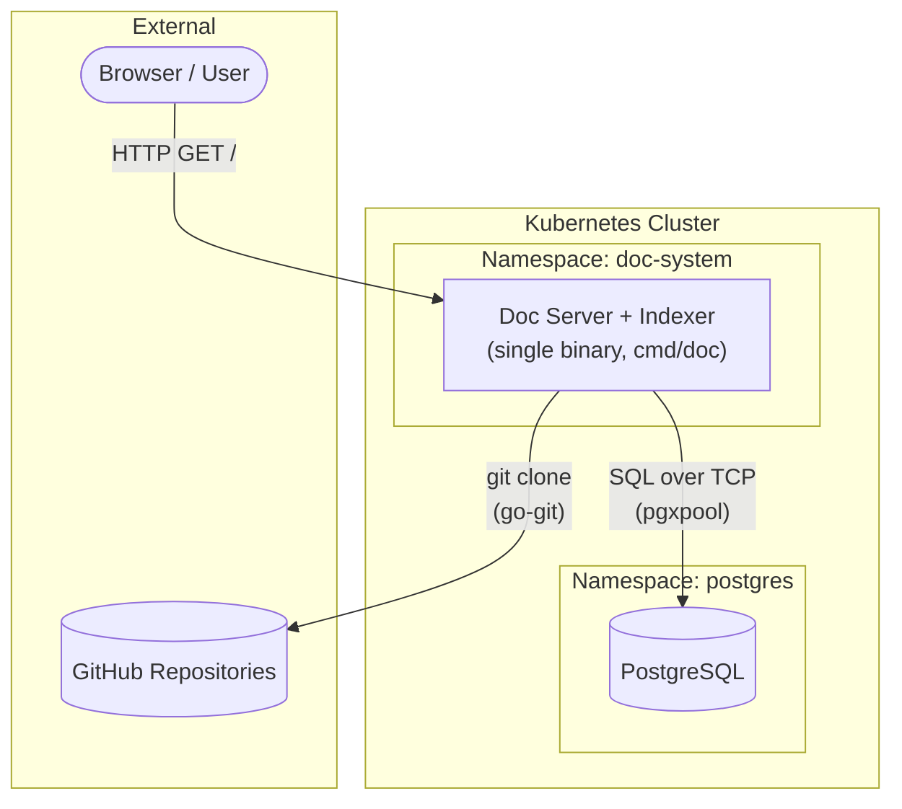
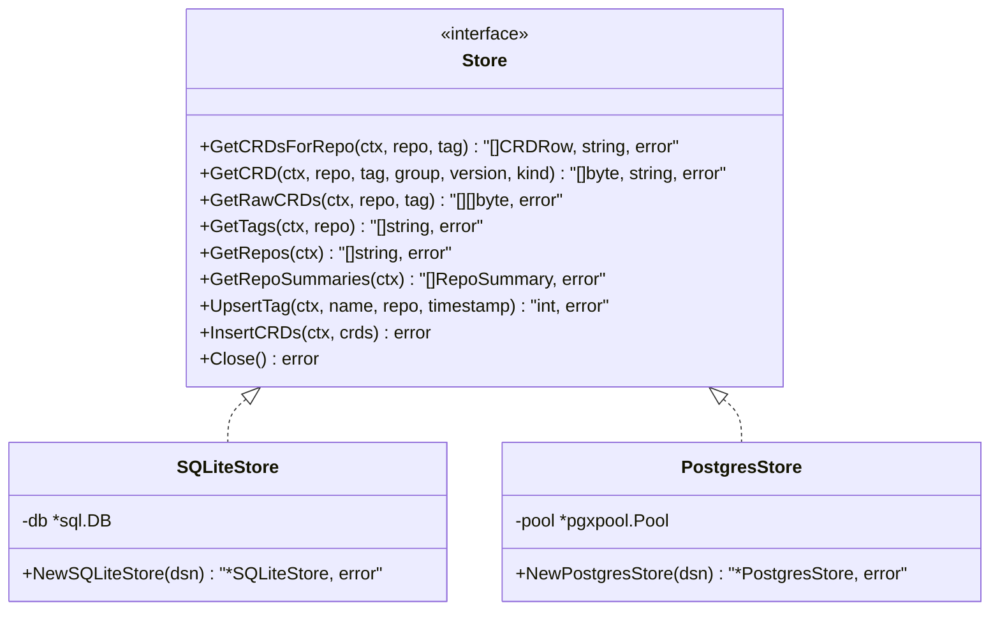
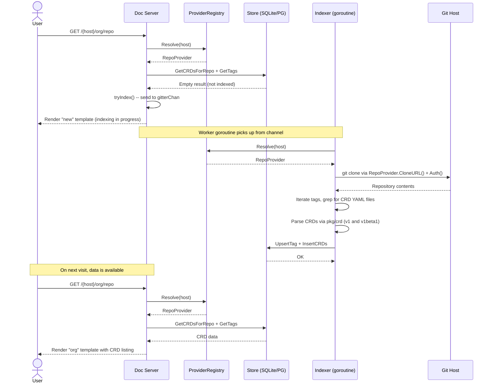
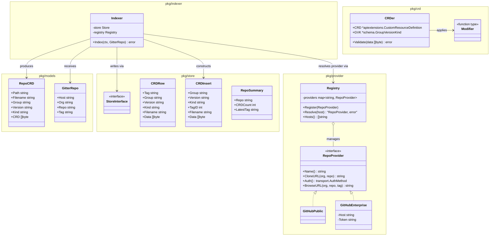
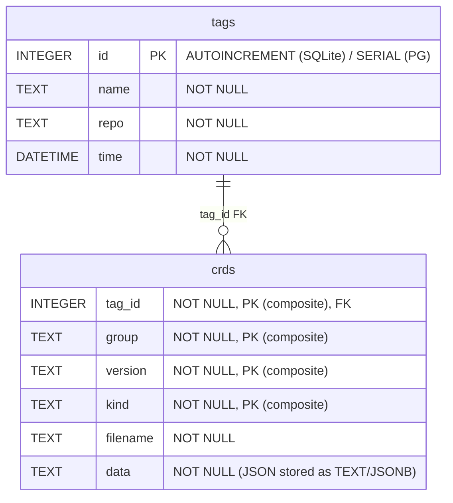
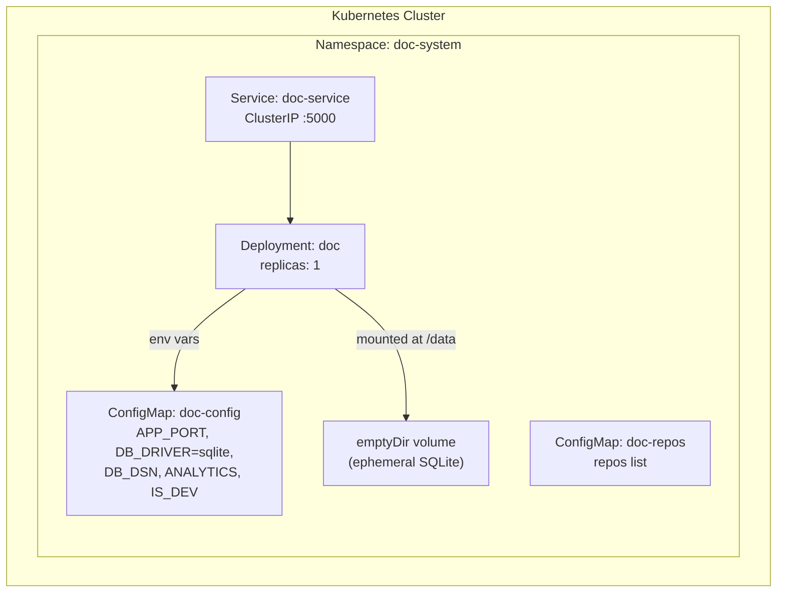
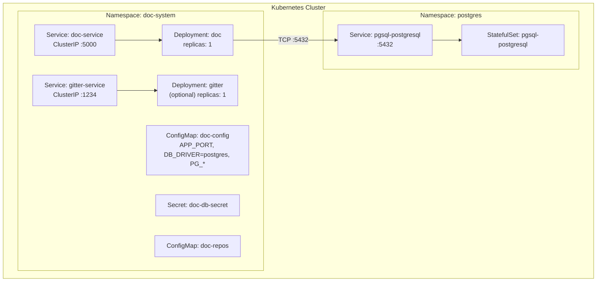
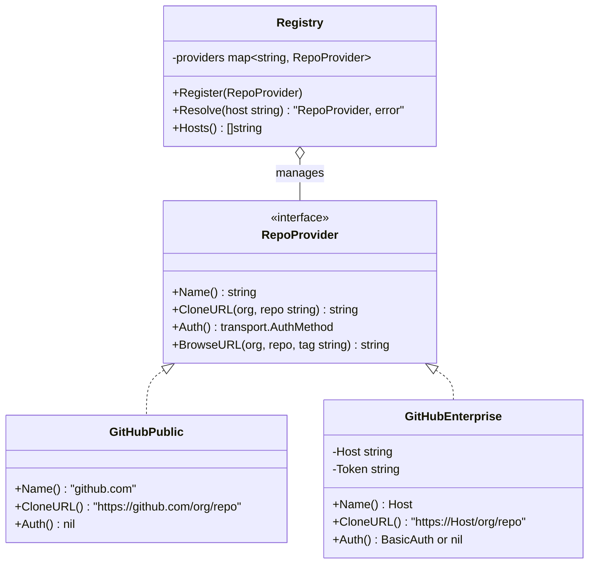

# Architecture

**Doc** (`doc.crds.dev`) is a web application that automatically discovers, indexes, and renders documentation for Kubernetes Custom Resource Definitions (CRDs) hosted in GitHub repositories. It consists of a single binary with an embedded indexer, backed by a configurable database (SQLite by default, PostgreSQL optional for backward compatibility).

---

## Table of Contents

- [High-Level System Architecture](#high-level-system-architecture)
- [Component Overview](#component-overview)
- [Store Interface](#store-interface)
- [Request Flow](#request-flow)
- [Structs and Models Dependency Diagram](#structs-and-models-dependency-diagram)
- [Database Schema](#database-schema)
- [Deployment Architecture](#deployment-architecture)
- [Project Structure](#project-structure)
- [Provider Abstraction](#provider-abstraction)
- [Proposed Improvements](#proposed-improvements)

---

## High-Level System Architecture

The application supports two database backends, selected via the `DB_DRIVER` environment variable:

### Default Mode (DB_DRIVER=sqlite)



### Backward-Compatible Mode (DB_DRIVER=postgres)



An optional standalone gitter binary (`cmd/gitter`) is kept for backward compatibility with existing PostgreSQL deployments that use the `net/rpc` architecture.

---

## Component Overview

### Doc Web Server (`cmd/doc`)

The user-facing HTTP server built with `gorilla/mux`. It serves HTML pages rendered via Go's `html/template` engine (through the `unrolled/render` library). It reads CRD data from the configured Store (SQLite or PostgreSQL) and, when a repository is not yet indexed, dispatches an indexing job to a pool of worker goroutines that call `pkg/indexer` directly.

Template data structs share a common `pageData` base that carries both layout flags (`Analytics`, `IsDarkMode`, `DisableNavBar`, `Title`) and route context (`Host`, `Repo`, `Tag`, `Group`, `Version`, `Kind`). Page-specific structs (`docData`, `orgData`, `homeData`) embed `pageData` via a `Page` field and add their own fields. Templates access shared fields via `.Page.*` (e.g. `.Page.Host`), which allows partials like the navbar to safely check `{{ if .Page.Host }}` regardless of which data struct is passed.

**Key responsibilities:**

| Responsibility | Details |
|---|---|
| Serve home page | `GET /` -- renders the landing page with a search bar and, when indexed repos exist, a filterable table of previously indexed repositories (repo name, CRD count, latest tag) loaded via `Store.GetRepoSummaries()` |
| Serve org/repo page | `GET /{host}/{org}/{repo}[@{tag}]` -- lists all CRDs for a repo at a given tag |
| Serve CRD doc page | `PathPrefix("/")` catch-all -- parses `/{host}/{org}/{repo}/{group}/{version}/{kind}[@{tag}]` via `parseRepoURL()` and renders the OpenAPI v3 schema for a specific CRD |
| Serve raw CRDs | `GET /raw/{host}/{org}/{repo}[@{tag}]` -- returns raw YAML of all CRDs |
| Trigger indexing | Sends job to `gitterChan`; worker goroutines call `indexer.Index()` directly |
| Resolve providers | Validates `{host}` against the `ProviderRegistry` before processing |
| Optional analytics | Sends pageview hits to Google Analytics when `ANALYTICS=true` |

### Indexer (`pkg/indexer`)

The indexing engine, extracted from the former `cmd/gitter` service. It clones a Git repository (via the `RepoProvider` abstraction in `pkg/provider`), scans for YAML files containing `kind: CustomResourceDefinition`, parses them via `pkg/crd`, and persists results to the Store.

**Key responsibilities:**

| Responsibility | Details |
|---|---|
| Resolve provider | Looks up `RepoProvider` from the `ProviderRegistry` by host |
| Clone repositories | Uses `go-git` with `RepoProvider.CloneURL()` and `RepoProvider.Auth()` to shallow-clone repos into a temp directory |
| Discover tags | Iterates over git tags (or a specific tag if requested) |
| Extract CRDs | Greps YAML files for CRD manifests, splits multi-document YAML |
| Parse and validate | Converts v1 and v1beta1 CRDs to the internal `apiextensions` representation via `pkg/crd` |
| Persist to Store | Calls `Store.UpsertTag()` and `Store.InsertCRDs()` |

### Standalone Gitter (`cmd/gitter`) -- Optional, Backward Compat

A thin `net/rpc` wrapper around `pkg/indexer` for backward compatibility with existing PostgreSQL-based deployments. Not needed in SQLite mode.

### Shared Packages

| Package | Purpose |
|---|---|
| `pkg/provider` | Repository host abstraction: `RepoProvider` interface, `Registry`, and built-in implementations (`GitHubPublic`, `GitHubEnterprise`) |
| `pkg/store` | Database abstraction: `Store` interface with SQLite and PostgreSQL implementations |
| `pkg/indexer` | CRD indexing engine (clones repos via `RepoProvider`, parses CRDs, writes to Store) |
| `pkg/models` | Shared data-transfer structs (`RepoCRD`, `GitterRepo`) |
| `pkg/crd` | CRD parsing, validation, version conversion (v1 / v1beta1 to internal), and modifier functions |

---

## Store Interface

The `pkg/store` package defines a `Store` interface that abstracts all database operations. Two implementations are provided:



The `store.New(driver, dsn)` constructor accepts an explicit driver name (`"sqlite"`, `"postgres"`, or `""` which defaults to SQLite) and a DSN string. The higher-level `store.NewFromEnv()` factory reads `DB_DRIVER` and `DB_DSN` environment variables and delegates to `New()`. For backward compatibility, if `DB_DRIVER` is not set but `PG_HOST` is present, `NewFromEnv()` automatically falls back to PostgreSQL mode.

| Variable | Default | Description |
|---|---|---|
| `APP_PORT` | `5000` | HTTP listen port for the Doc server |
| `DB_DRIVER` | `sqlite` | Backend: `sqlite` or `postgres` |
| `DB_DSN` | `./doc.db` | File path (SQLite) or connection string (PostgreSQL) |

---

## Request Flow

The following diagram illustrates the typical flow when a user visits a CRD documentation page for a repository that has not yet been indexed (SQLite mode).



---

## Structs and Models Dependency Diagram



### Struct Roles Summary

| Struct | Package | Role |
|---|---|---|
| `RepoProvider` | `pkg/provider` | Interface abstracting Git host operations (clone URL, auth, browse URL) |
| `Registry` | `pkg/provider` | Maps hostnames to `RepoProvider` instances; validates incoming requests |
| `GitHubPublic` | `pkg/provider` | Zero-config provider for public `github.com` repos |
| `GitHubEnterprise` | `pkg/provider` | Configurable provider for GHE hosts with optional token auth |
| `Store` | `pkg/store` | Interface abstracting all database read/write operations |
| `CRDRow` | `pkg/store` | Read result from database queries |
| `CRDInsert` | `pkg/store` | Write payload for batch CRD inserts |
| `RepoSummary` | `pkg/store` | Aggregate info (repo path, CRD count, latest tag) for the home page listing |
| `RepoCRD` | `pkg/models` | Represents a single CRD extracted from a repo |
| `GitterRepo` | `pkg/models` | Identifies which host/repo/tag to index |
| `Indexer` | `pkg/indexer` | Resolves provider, clones repos, parses CRDs, writes to Store |
| `CRDer` | `pkg/crd` | Wraps a parsed CRD with its GVK; provides `Validate()` |
| `Modifier` | `pkg/crd` | Function type for pre-processing CRDs |

---

## Database Schema

The schema is identical in both backends with minor dialect differences.



| Column | SQLite Type | PostgreSQL Type |
|---|---|---|
| `tags.id` | `INTEGER PRIMARY KEY AUTOINCREMENT` | `SERIAL PRIMARY KEY` |
| `tags.name` | `TEXT` | `VARCHAR(255)` |
| `tags.repo` | `TEXT` | `VARCHAR(255)` |
| `tags.time` | `DATETIME` | `TIMESTAMP` |
| `crds.group` | `TEXT` | `VARCHAR(255)` |
| `crds.version` | `TEXT` | `VARCHAR(255)` |
| `crds.kind` | `TEXT` | `VARCHAR(255)` |
| `crds.filename` | `TEXT` | `VARCHAR(255)` |
| `crds.data` | `TEXT` (JSON as string) | `JSONB` |

In **SQLite mode**, the schema is auto-applied at startup via `CREATE TABLE IF NOT EXISTS` (embedded in `pkg/store/sqlite.go`). In **PostgreSQL mode**, the schema is applied via the existing init Job (`schema/crds_up.sql`).

---

## Deployment Architecture

### Default: SQLite Mode



No PostgreSQL, no Secrets, no init Job, no gitter Deployment. Data is ephemeral -- lost on pod restart and re-indexed on demand.

### Backward Compat: PostgreSQL Mode



---

## Project Structure

```
doc/
├── cmd/
│   ├── doc/              # Doc web server + indexer (main binary)
│   │   ├── main.go
│   │   ├── parse_test.go
│   │   └── template_test.go
│   └── gitter/           # Standalone gitter (backward compat, optional)
│       └── main.go
├── pkg/
│   ├── provider/         # Repository host abstraction
│   │   ├── provider.go   # RepoProvider interface, Registry, GitHubPublic, GitHubEnterprise
│   │   ├── config.go     # ProviderConfig, RegistryFromConfigs(), DefaultConfigs()
│   │   └── provider_test.go
│   ├── store/            # Database abstraction layer
│   │   ├── store.go      # Store interface + shared types
│   │   ├── sqlite.go     # SQLite implementation
│   │   ├── sqlite_test.go # SQLite store tests
│   │   ├── postgres.go   # PostgreSQL implementation
│   │   └── factory.go    # NewFromEnv() factory
│   ├── indexer/          # CRD indexing engine
│   │   └── indexer.go
│   ├── crd/              # CRD parsing, validation, modifiers
│   │   ├── crd.go
│   │   └── crd_test.go
│   └── models/           # Shared data-transfer structs
│       └── repo.go
├── template/             # HTML templates (Go html/template)
├── static/
│   └── root.css          # Application stylesheet
├── schema/
│   ├── crds_up.sql       # PostgreSQL DDL
│   └── crds_up_sqlite.sql # SQLite DDL (reference; embedded in Go)
├── config/
│   ├── app/              # ytt templates for K8s app manifests
│   ├── database/         # ytt templates for PostgreSQL (only for pg mode)
│   ├── helm/             # Helm values for PostgreSQL chart
│   └── values.yml        # Default configuration values
├── deploy/
│   ├── doc.Dockerfile    # Multi-stage build for doc server
│   └── gitter.Dockerfile # Multi-stage build for gitter (backward compat)
├── Makefile              # Build, test, deploy automation
└── DEVELOPING.md         # Developer guide
```

---

## Provider Abstraction

The application supports multiple Git hosting platforms through the `RepoProvider` interface in `pkg/provider`. URL routing, clone URLs, and authentication are all delegated to provider implementations rather than hardcoded to any specific host.

### Architecture



### How It Works

| Area | Implementation |
|---|---|
| **URL routing** | Routes use `/{host}/{org}/{repo}` -- the `{host}` path variable is resolved against the `Registry` |
| **Clone URL** | Delegated to `RepoProvider.CloneURL()`, supporting custom hosts and schemes |
| **Git authentication** | Delegated to `RepoProvider.Auth()` -- `GitHubEnterprise` injects `BasicAuth` when a token is configured |
| **URL parsing** | `parseRepoURL()` is host-agnostic: `/{host}/{org}/{repo}/{group}/{version}/{kind}[@{tag}]` |
| **DB `tags.repo` column** | Stores the full host-qualified path (e.g. `github.com/org/repo`, `ghe.corp.com/org/repo`) |
| **Configuration** | `ProviderConfig` structs loaded via `DefaultConfigs()` or a `providers` section in `config/values.yml`. Note: `AllowedOrgs` is declared in `ProviderConfig` but not yet enforced by `buildProvider()` |

### Adding a New Provider

1. Add a `ProviderConfig` entry to `config/values.yml`:

   ```yaml
   providers:
     - host: "github.com"
       type: "github"
     - host: "github.mycompany.com"
       type: "github-enterprise"
       auth_secret: "GHE_TOKEN"
   ```

2. Set the auth secret as an environment variable (the `secretResolver` function passed to `RegistryFromConfigs` reads it):

   ```bash
   export GHE_TOKEN=ghp_xxxxxxxxxxxx
   ```

3. Existing `github.com/...` URLs continue to work unchanged.

### Implementing a New Provider Type

To support a non-GitHub host (e.g. GitLab, Bitbucket), implement the `RepoProvider` interface and register the new type in `buildProvider()` in `pkg/provider/config.go`.

---

## Proposed Improvements

- **Search-as-you-type autocomplete**: Integrate the home page repo listing into the search bar as an autocomplete dropdown, so users see matching indexed repos as they type.
- **Staleness indicator**: Show when each repo was last indexed (from `tags.time`) and offer a "re-index" button for stale entries.
- **Grouped by org**: Group repos by `{host}/{org}` with collapsible sections for better organization at scale.
- **Async loading**: Add a `GET /api/repos` JSON endpoint so the repo list can be loaded asynchronously, avoiding increased page load time when the DB is large.
